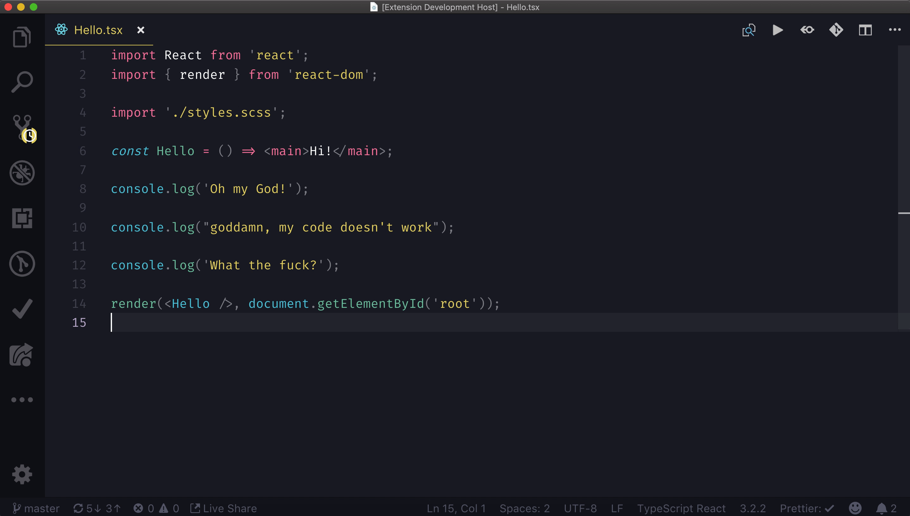

# No profanity

Some of us may have this problem when after hours of debugging some not so decent words sneak into the console logs. It may be quite a shame to accidentally commit them and let everybody in your team see your real nature. So, the extension will be censoring all the bad words from the console logs 🤬.

